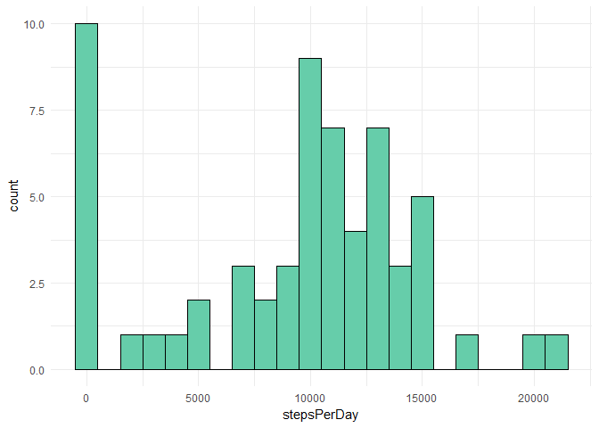
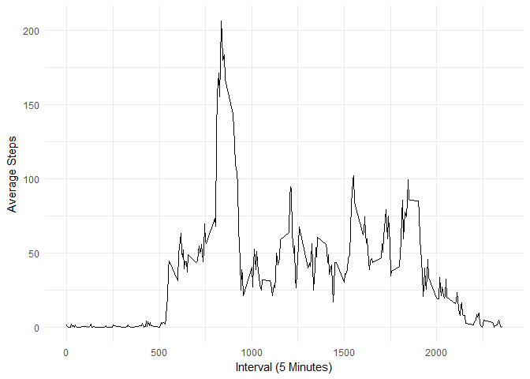
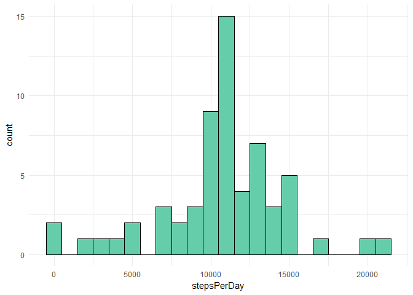
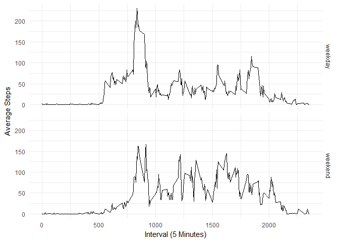

# Reproducible Research: Peer Assessment 1
Jack Fawcett  
April 5, 2017  

R Version `3.3.1`  
Libraries used throughout:

```r
library(ggplot2)
```

```
## Warning: package 'ggplot2' was built under R version 3.3.2
```


## Loading and preprocessing the data
Minimal data preprocessing done, reading the csv and converting the date column into a `Date` type.

```r
# Reading data
activity <- read.csv("activity.csv", stringsAsFactors = F)
activity$date <- as.Date(activity$date)
```

## What is mean total number of steps taken per day?
First we have to `sum` the steps over each date to obtain manageable data. Then plot using the `ggplot` package.

```r
# Steps per day
stepsPerDay <- tapply(activity$steps, activity$date, FUN=sum, na.rm=TRUE)
ggplot() + 
    geom_histogram(aes(stepsPerDay), binwidth = 1000, fill = "aquamarine3", color = "black") + 
    theme_minimal()
```

<!-- -->
  
  
Calculating the overall mean and median for the data is done using (we remove the missing values for now):

```r
mean(stepsPerDay, na.rm = T)
```

```
## [1] 9354.23
```

```r
median(stepsPerDay, na.rm = T)
```

```
## [1] 10395
```

## What is the average daily activity pattern?
Again we need to aggregate the data, but by the `interval` this time.

```r
# Average daily activity pattern
stepsPerInterval <- aggregate(x=list(steps=activity$steps), by=list(interval=activity$interval), FUN=mean, na.rm=TRUE)
ggplot(stepsPerInterval, aes(x=interval, y=steps)) +
    geom_line() +
    xlab("Interval (5 Minutes)") +
    ylab("Average Steps") +
    theme_minimal()
```

<!-- -->
  
  
It is easy to find the maximum amount of steps in our new data using the `which.max()` function:

```r
stepsPerInterval[which.max(stepsPerInterval$steps),]
```

```
##     interval    steps
## 104      835 206.1698
```

## Imputing missing values
Checking how many missing values we are working with:

```r
# Missing Values
nrow(activity[is.na(activity$steps),])
```

```
## [1] 2304
```
Creating a function that takes a row from the data and fills in the `steps` value if it is missing with the average for that particular `interval`, which it looks up from the previously calculated `data frame`.

```r
missingValue <- function(x) {
    if(is.na(x[1])){
        x[1] <- stepsPerInterval$steps[as.integer(x[3]) == stepsPerInterval$interval]
        return(x)
    } else{
        return(x)
    }
}
activitymv <- as.data.frame(t(apply(activity,1,missingValue)))
# Data type overhead
activitymv$steps <- as.numeric(as.character(activitymv$steps))
activitymv$interval <- as.numeric(as.character(activitymv$interval))
activitymv$date <- as.Date(activitymv$date)
```

Using the same technique as earlier to aggregate our data by date and plotting in `ggplot`:

```r
stepsPerDay <- tapply(activitymv$steps, activitymv$date, FUN=sum, na.rm=TRUE)
ggplot() + 
    geom_histogram(aes(stepsPerDay), binwidth = 1000, fill = "aquamarine3", color = "black") + 
    theme_minimal()
```

<!-- -->
  
  
Checking the mean and median again shows that they are both very similar as well as higher than the originals. 

```r
mean(stepsPerDay, na.rm = T)
```

```
## [1] 10766.19
```

```r
median(stepsPerDay, na.rm = T)
```

```
## [1] 10766.19
```
This is because days with values of `NA` were considered as 0 by default, so when filled in this effect is reduced.
## Are there differences in activity patterns between weekdays and weekends?
Making us of `weekdays()`, a new factor variable is created that identifies a day as a `weekday` or `weekend`

```r
# Weekdays and Weekends
activitymv$day <- ifelse(weekdays(activitymv$date) %in% c("Monday", "Tuesday", "Wednesday", "Thursday", "Friday"), "weekday", "weekend")
stepsPerIntervalDay <- aggregate(x=list(steps=activitymv$steps), by=list(interval=activitymv$interval, day=activitymv$day), FUN=mean, na.rm=TRUE)
ggplot(stepsPerIntervalDay, aes(interval, steps)) + 
    geom_line() + 
    facet_grid(day ~ .) +
    xlab("Interval (5 Minutes)") +
    ylab("Average Steps") +
    theme_minimal()
```

<!-- -->
  
  
There is a clear difference between weekends and the rest of the week, which can be accommodated by the differing activities. On weekdays there is a larger skew towards shorter intervals. Where as at the weekend there is more of a general distribution.
